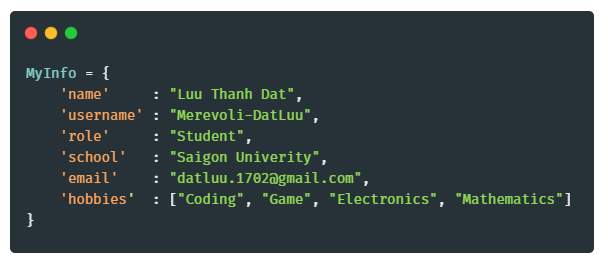

### Hi there 👋

  

<h2>Who Am I?</h2>

  

<!--
**Merevoli-DatLuu/Merevoli-DatLuu** is a ✨ _special_ ✨ repository because its `README.md` (this file) appears on your GitHub profile.

Here are some ideas to get you started:

- 🔭 I’m currently working on ...
- 🌱 I’m currently learning ...
- 👯 I’m looking to collaborate on ...
- 🤔 I’m looking for help with ...
- 💬 Ask me about ...
- 📫 How to reach me: ...
- 😄 Pronouns: ...
- ⚡ Fun fact: ...
-->

<h2>Languages and Tools</h2>
<code></code>
<code></code>
<code></code>
<code></code>
<code></code>
<code></code>

<table border = "0" width = "100%">
  <tr>
    <td>
      <h2>My Top Language</h2>
      
    </td>
    <td>
      <h2>My GitHub Stats</h2>
      
    </td>
  </tr>
  
</table>
